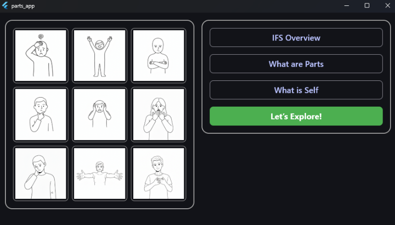

# IFS Parts – v2.0.0 (New Landing Experience)

A private, offline tool for Internal Family Systems (IFS) part work.  
Explore 99 therapeutic cards, reflect on your parts, and export your session — all without internet, telemetry, or data collection.



> ℹ️ **For educational and personal use only** — not a substitute for therapy or emergency care.

---

## 🚫 Step 0: Remove Any Older Versions

Running multiple versions can cause confusion or data conflicts. **Always remove old versions before installing v2.0.0.**

### Windows

1. **Find old versions**:  
   - Look in common locations:  
     - `C:\Apps\IFS Parts\`  
     - `C:\Users\<YourName>\Downloads\`  
     - Desktop (`C:\Users\<YourName>\Desktop\`)  
   - Search File Explorer for folders containing `parts_app.exe`.

2. **Remove completely**:  
   - Close the app if running.  
   - Delete the **entire folder** containing the old version.  
   - Empty the Recycle Bin.

### macOS

1. **Find old versions**:  
   - Open **Finder** → **Applications**  
   - Look for an app named **IFS Parts**  
   - Also check:  
     - `~/Downloads/` (for `.dmg` or extracted folders)  
     - `/Applications/` (main install location)

2. **Remove completely**:  
   - Quit the app (right-click Dock icon → **Quit**)  
   - Drag **IFS Parts** from **Applications** to the **Trash**  
   - Empty the Trash  
   - (Optional but recommended) Remove support files:  
     ```bash
     rm -rf ~/Library/Application\ Support/ifs_parts_flutter
     ```

### Linux

1. **Find old versions**:  
   - Common locations:  
     - `~/Apps/IFS Parts/`  
     - `~/Downloads/`  
     - Any folder where you previously extracted the ZIP  
   - Search with:  
     ```bash
     find ~ -name "parts_app" 2>/dev/null
     ```

2. **Remove completely**:  
   - Close the app (Ctrl+C in terminal or close window)  
   - Delete the entire app folder (e.g., `rm -rf ~/Apps/IFS\ Parts/`)  
   - Empty your Trash if deleted via GUI

> ❗ Do **not** install v2.0.0 over an old version — always delete the old folder first.

---

## 📥 Install IFS Parts v2.0.0

All platforms are now **✅ Released**.

| Platform | Status     | Download |
|----------|------------|----------|
| Windows  | ✅ Released | [IFS Parts Windows.zip](https://github.com/fintube61git/ifs-parts-flutter/releases/tag/v2.0.0) |
| macOS    | ✅ Released | [IFS Parts macOS v2.0.0.dmg](https://github.com/fintube61git/ifs-parts-flutter/releases/tag/v2.0.0) |
| Linux    | ✅ Released | [IFS Parts Linux.zip](https://github.com/fintube61git/ifs-parts-flutter/releases/tag/v2.0.0) |

### Windows Installation

1. Download **IFS Parts Windows.zip**  
2. Extract the **entire folder** to a permanent location (e.g., `C:\Apps\IFS Parts\`)  
   ❌ Avoid `Downloads`, `Desktop`, or temporary folders — Windows may auto-delete them!  
3. Open the folder and double-click `parts_app.exe`  
4. (Optional) Pin to Start or Taskbar

### macOS Installation

1. Download **IFS Parts macOS v2.0.0.dmg**  
2. Open the `.dmg` file  
3. Drag **IFS Parts** into your **Applications** folder  
4. **Eject the disk image**  
5. Launch from **Applications** (not from the `.dmg`)

> **First launch?** macOS may block the app. To approve:  
> - Go to **System Settings → Privacy & Security → Security**  
> - Click **Open Anyway** next to the warning  
> - Or: Right-click the app in **Applications** → **Open** → **Open**

### Linux Installation

1. Download **IFS Parts Linux.zip**  
2. Extract to a permanent location (e.g., `~/Apps/IFS Parts/`)  
   ❌ Avoid `~/Downloads` — some distros auto-clean it!  
3. Open a terminal in the extracted folder  
4. Make the app executable (if needed):  
   ```bash
   chmod +x parts_app